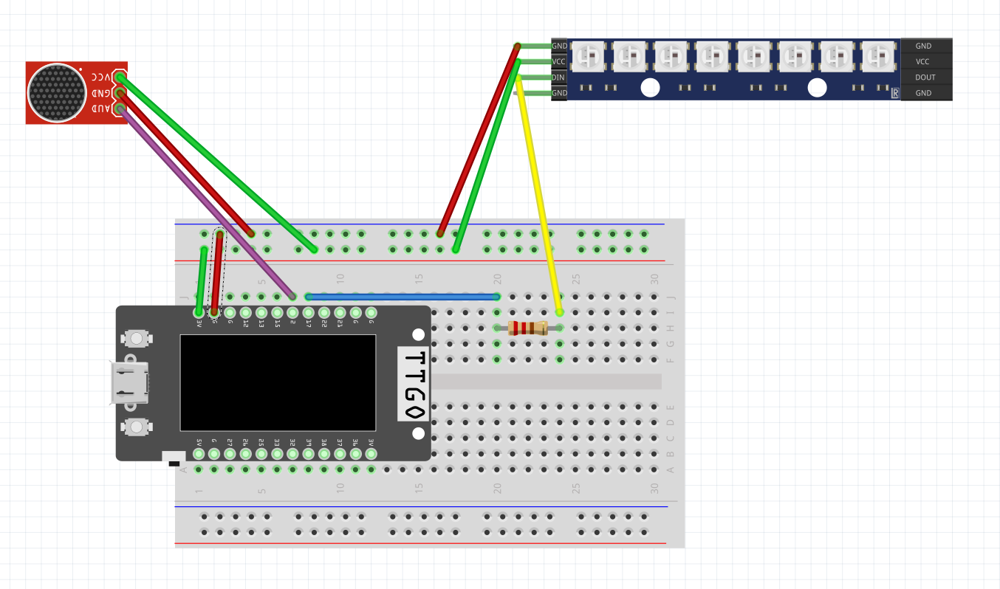

# [Sound Reactive LED Lamp](https://incongruous-literature-ab3.notion.site/Final-Project-Sound-Reactive-LED-Lamp-159b01346aae80d78827ffa08fb50904)
## About 
This is a colorful lamp that reacts to the sounds around it. My goal was to create a simple yet nice enclosure that ensures that the changing brightness can be visible!

    

## Parts
- Neopixel WS2812b 1x8 LED Strip
- Max 9814 Microphone Amplifier
- ESP32 (using Lilygo ESP32 TTGO in this case)
- Power supplyer for ESP32
- 450ohm resistor for neopixel
- Breadboard
- Male-to-male header cables
- 1/8" plywood
- Vellum

### Circuit diagram
- ``final_fritzing.fzz`` or the following screenshot, route the hardware as shown above.

### Instructions 
1) Using the [Arduino IDE](https://www.arduino.cc/en/software), open ``led_show.ino``
2) Using the fritzing diagram, correctly connect wiring to ESP and breadboard
3) Upload the arduino code to the ESP32 and run it to ensure it works
4) Using the provided SVG files, convert them to correct color and size for laser cutting
5) Using wood glue, glue the pieces together like in the STL image
6) Wrap in vellum and glue it down
7) Insert the breadboard and wiring into lamp and secure!
